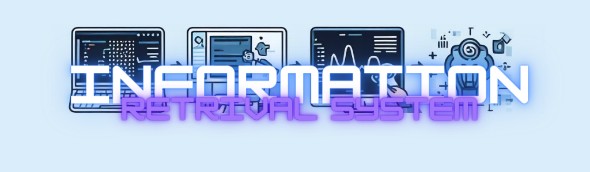
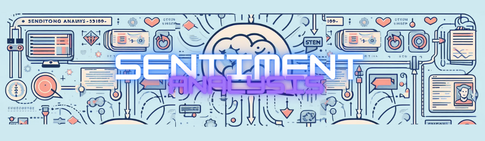
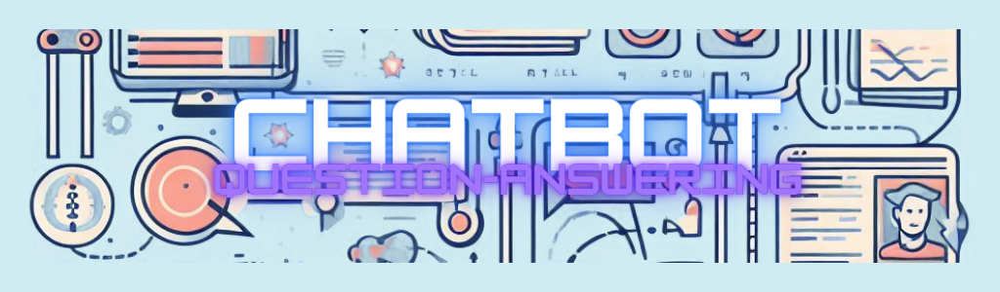

# NLP - PosgradoIA_UBA

AI-Specialization - UBA (Universidad Nacional de Buenos Aires) - NLP Projects

## TextVectorization

Link to colab: **[TextVectorization](https://github.com/Tincho1902/PosgradoIA/blob/main/1a_vectorizacion.ipynb)**

## Information Retrieval System with NLTK

Link to colab: **[Information Retrieval System](https://github.com/Tincho1902/PosgradoIA/blob/main/2c%20-%20bot_tfidf_nltk.ipynb)**

## Custom embedddings with Gensim

Link to colab: **[Custom embedddings](https://github.com/Tincho1902/PosgradoIA/blob/main/3b_Custom_embedding_con_Gensim.ipynb)**

## Next word prediction

Link to colab: **[Next word prediction](https://github.com/Tincho1902/PosgradoIA/blob/main/4d%20-%20predicci%C3%B3n_palabra_tensorflow.ipynb)**

Next word prediction models are models that can generate the most likely word to follow a given sequence of words. They are useful for applications such as text completion, text generation, machine translation, and speech recognition. Next word prediction models are based on natural language processing (NLP), which is the field of computer science that deals with understanding and manipulating natural language.

There are different types of next word prediction models, such as:

- **N-gram models**: These models use the frequency of n consecutive words in a large corpus of text to estimate the probability of the next word. For example, a bigram model uses the previous word, and a trigram model uses the previous two words, to predict the next word. N-gram models are simple and fast, but they have limitations such as data sparsity and lack of context.
- **Neural network models**: These models use artificial neural networks, which are computational systems that can learn from data, to predict the next word. Neural network models can capture complex patterns and dependencies in language, and can generate more diverse and fluent texts. Some examples of neural network models are recurrent neural networks (RNNs), long short-term memory networks (LSTMs), and transformers.

If you want to learn more about next word prediction models, you can check out these resources:

- [Next Word Prediction Model using Python](https://thecleverprogrammer.com/2023/07/17/next-word-prediction-model-using-python/): This is a tutorial that shows how to build a next word prediction model using Python and LSTM.
- [Next Word Prediction with Deep Learning Models](https://link.springer.com/chapter/10.1007/978-3-031-09753-9_38): This is a research paper that compares different deep learning models for next word prediction on Turkish corpus.
- [Exploring the Next Word Predictor!](https://link.springer.com/chapter/10.1007/978-3-031-09753-9_38): This is a blog post that explains the concepts and implementation of n-gram and LSTM models for next word prediction.
- [Stacked Language Models for an Optimized Next Word Generation](https://towardsdatascience.com/exploring-the-next-word-predictor-5e22aeb85d8f): This is another research paper that proposes a stacked language model that combines three models for next word generation.
- [Next Word Prediction Using Deep Learning: A Comparative Study](https://ieeexplore.ieee.org/document/9845545): This is yet another research paper that evaluates different deep learning models for next word prediction on English corpus.

Origin:

(1) next-word-prediction · GitHub Topics · GitHub. 

https://github.com/topics/next-word-prediction.

(2) Next Word Prediction with Deep Learning Models | SpringerLink. 

https://link.springer.com/chapter/10.1007/978-3-031-09753-9_38.

(3) Next Word Prediction Model using Python | Aman Kharwal. 

https://thecleverprogrammer.com/2023/07/17/next-word-prediction-model-using-python/.

(4) Next Word Prediction with Deep Learning Models | SpringerLink. 

https://link.springer.com/chapter/10.1007/978-3-031-09753-9_38.

(5) Exploring the Next Word Predictor! - Towards Data Science. 

https://towardsdatascience.com/exploring-the-next-word-predictor-5e22aeb85d8f.

(6) Stacked Language Models for an Optimized Next Word Generation. 

https://ieeexplore.ieee.org/document/9845545.

## Sentiment analysis with Embeddings + LSTM

Link to colab: **[Sentiment analysis](https://github.com/Tincho1902/PosgradoIA/blob/main/5-clothing-ecommerce-reviews.ipynb)**

Sentiment analysis is a technique that uses natural language processing, text analysis, computational linguistics, and biometrics to systematically identify, extract, quantify, and study affective states and subjective information in a text. It can help to understand the opinions, emotions, and intentions of customers, users, or other stakeholders in various domains and channels.

Some examples of applications of sentiment analysis are:

- **Customer feedback analysis**: Sentiment analysis can help businesses to understand the satisfaction and loyalty of their customers by analyzing their reviews, ratings, surveys, comments, etc. This can help to improve customer service, product quality, marketing strategies, etc.
- **Social media analysis**: Sentiment analysis can help to monitor the public opinion and trends on social media platforms, such as Twitter, Facebook, Instagram, etc. This can help to identify the influencers, the sentiments, the topics, the hashtags, etc., related to a brand, a product, a service, or a person.
- **Market research**: Sentiment analysis can help to conduct market research and analysis by collecting and analyzing data from various sources, such as news articles, blogs, forums, reports, etc. This can help to understand the market needs, demands, opportunities, threats, etc.
- **Healthcare**: Sentiment analysis can help to improve healthcare services and outcomes by analyzing the emotions and sentiments of patients and caregivers from various sources, such as medical records, clinical notes, online forums, etc. This can help to diagnose mental health conditions, monitor patient satisfaction and well-being, provide personalized care and support, etc.

Origin:
(1) Sentiment analysis - Wikipedia. 

https://en.wikipedia.org/wiki/Sentiment_analysis.

(2) What is Sentiment Analysis? A Complete Guide for Beginners. 

https://www.freecodecamp.org/news/what-is-sentiment-analysis-a-complete-guide-to-for-beginners/.

(3) ¿Qué es el análisis de sentimiento? | Microsoft Dynamics 365. 

https://dynamics.microsoft.com/es-es/ai/customer-insights/what-is-sentiment-analysis/.

## Question-Answering ChatBOT with LSTM

Link to colab: **[ChatBOT with LSTM](https://github.com/Tincho1902/PosgradoIA/blob/main/6-bot-qa.ipynb)**

A chatbot to question-answering using LSTM is a chatbot that uses LSTM to encode the user's question and decode the answer from the relevant data. LSTM can help the chatbot to understand the meaning and context of the question, and generate a coherent and accurate answer. Some examples of chatbot to question-answering using LSTM are:

- [Neural-chatbot](^1^): This is a GitHub repository that shows how to build a question-answer style chatbot using LSTM for language models with attention mechanism. The chatbot uses Twitter and Cornell movie subtitle datasets as the data source.
- [Conversational_Chatbot_using_LSTM](^2^): This is another GitHub repository that shows how to create a conversational chatbot using sequence to sequence LSTM models. The chatbot uses Chatterbot Kaggle English dataset as the data source.
- [Chatbot-Using-LSTM](^3^): This is yet another GitHub repository that shows how to implement a retrieval-based chatbot for a ticketing portal using TensorFlow and LSTM. The chatbot uses a custom dataset of queries and responses as the data source.
- [Build a generative chatbot using recurrent neural networks (LSTM RNNs)](^4^): This is a tutorial that shows how to build a generative chatbot using LSTM RNNs and Keras. The chatbot uses a custom dataset of jokes as the data source.

Origin:

(1) GitHub - liambll/neural-chatbot: Chatbot with LSTM Sequence To Sequence .... 

https://github.com/liambll/neural-chatbot.

(2) ShrishtiHore/Conversational_Chatbot_using_LSTM - GitHub. 

https://github.com/ShrishtiHore/Conversational_Chatbot_using_LSTM.

(3) Chatbot-Using-LSTM - GitHub. 

https://github.com/dasnikita/Chatbot-Using-LSTM.

(4) Build a generative chatbot using recurrent neural networks (LSTM RNNs .... 

https://hub.packtpub.com/build-generative-chatbot-using-recurrent-neural-networks-lstm-rnns/.
